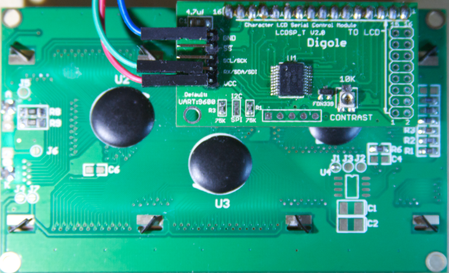
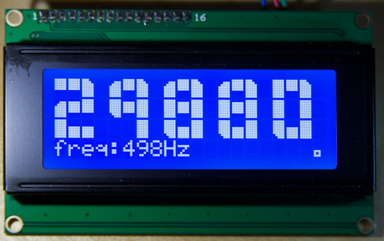

# esp8266_digoleserial

This is a driver for the digole LCD adapter.
The adapter requires only one pin so it is possible to run this on an ESP-1.
This digole serial driver uses UART1, so it can only be attached to GPIO2.


As a demonstraton *user_main.c* runs a tachometer that displays the frequency and rpm of GPIO0 on a 4*20 LCD with big digits. I intend to use this very close to a [VFD](http://en.wikipedia.org/wiki/Variable-frequency_drive) and stepping motors so WiFi is totally out of the question.



To use the driver in your own project you only need to copy (or git subtree clone) the *digoleserial* and [*easygpio*](https://github.com/eadf/esp8266_easygpio) modules to your own project. Then add the module names to your Makefile:
```
# which modules (subdirectories) of the project to include in compiling
MODULES		= driver easygpio digoleserial bigint tachometer user
```

You will also have to include the *digoleserial.h* header file to your own code.

###Circuit
The digole serial adapter requires 5V to run, but it seems to work with 3V3 on ths RX pin. So the esp can be directly attached to the adapter.
###Default pin configuration
Frequency generator | Digole serial adapter | esp8266
--------------------|-----------------------|----------
3V3 Volt            |      N/A               | GPIO3 (RX)
N/A                  | RX/SDA/SDI            | GPIO2

It is easy to change the GPIO3 pin to something else with the *tachometer_init* function; 
```
int tachometer_pin=3;
tachometer_init(tachometer_pin);
```

###Issues
The baud setting refuses to work, my display adapters are stuck at 9600.

###Legalese
I'm not affiliated with digole in any way, so any faults found in this code are not of their doing. 
This code is provided as is, and it is not fit for any purpose.  

###License

The custom characters (and some of the code) defined in bigint.c are copied from some arduino library. Origin unknown.

The rest is GPL v3+

##Required:

esp_iot_sdk_v0.9.4_14_12_19

I've successfully tested this with sdk v0.9.5 (linux makefile).
