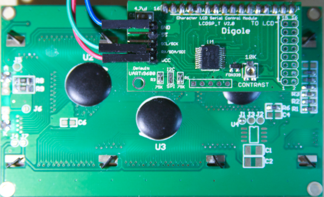
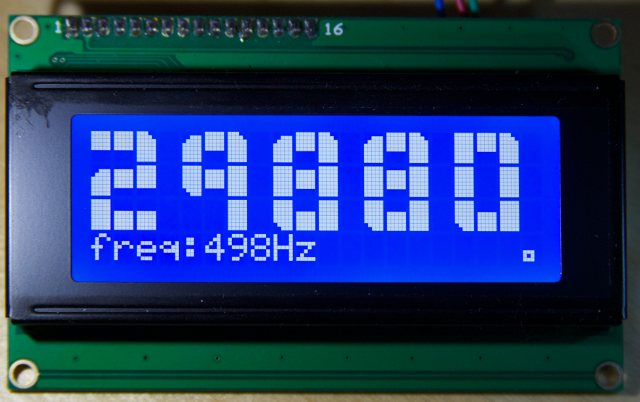

# esp8266_digoleserial

This is a driver for the digole LCD adapter.
The adapter requires only one pin so it is possible to run this on an ESP-1.
This digole serial driver uses UART1, so it can only be attached to GPIO2.


As a demonstraton *user_main.c* runs a tachometer that displays the frequency and rpm of GPIO0 on a 4*20 LCD with big digits. I intend to use this very close to a [VFD](http://en.wikipedia.org/wiki/Variable-frequency_drive) and stepping motors so WiFi is totally out of the question.



To use the driver in your own project you only need to copy (or git subtree clone) the *digoleserial* and [*easygpio*](https://github.com/eadf/esp8266_easygpio) modules to your own project. Then add the module names to your Makefile:
```
# which modules (subdirectories) of the project to include in compiling
MODULES		= driver easygpio digoleserial bigint tachometer user
```

You will also have to include the *digoleserial.h* header file to your own code.

###Circuit
The digole serial adapter requires 5V to run, but it seems to work with 3V3 on ths RX pin. So the esp can be directly attached to the adapter.
###Default pin configuration
Frequency generator | Digole serial adapter | esp8266
--------------------|-----------------------|----------
3V3 Volt            |      N/A               | GPIO3 (RX)
N/A                  | RX/SDA/SDI            | GPIO2

It is easy to change the GPIO3 pin to something else with the *tachometer_init* function; 
```
int tachometer_pin=3;
tachometer_init(tachometer_pin);
```

###Issues
The baud setting refuses to work, my display adapters are stuck at 9600.

###Legalese
I'm not affiliated with digole in any way, so any faults found in this code are not of their doing. 
This code is provided as is, and it is not fit for any purpose.  

###License

The custom characters (and some of the code) defined in bigint.c are copied from some arduino library. Origin unknown.

The rest is GPL v3+

###Building and installing:

First you need to install the sdk and the easy way of doing that is to use [esp_open_sdk.](https://github.com/pfalcon/esp-open-sdk)

You can put that anywhere you like (/opt/local/esp-open-sdk, /esptools etc etc)

Then you could create a small setenv.sh file, containing the location of your newly compiled sdk and other platform specific info;
```
export SDK_BASE=/opt/local/esp-open-sdk/sdk
export PATH=${SDK_BASE}/../xtensa-lx106-elf/bin:${PATH}
export ESPPORT=/dev/ttyO0  
```
(or setup your IDE to do the same)

In the root of this project create a soft link Makefile -> Makefile.[mac,linux]
```
ln -s Makefile.linux Makefile
```
You don't *have* to do this, it just makes it more convenient to run ```make``` (instead of ```make -f Makefile.linux```)

To make a clean build, flash and connect to the esp console you just do this in a shell:
```
source setenv.sh # This is only needed once per session
make clean && make test
```

You won't be needing esptool, my makefiles only uses esptool.py (provided by esp-open-sdk)

I have tested this with sdk v0.9.5 and v0.9.4 (linux & mac makefile)
